# Microduck Lab 🦆：机器人训练、世界模拟与云端 GPU

**简体中文（默认）** · [English](README_EN.md)

在普通 Mac 上训练 MicroDuck，在浏览器里观察它学习行走、整理玩具、跟随人物和参与足球对抗；也可以在同一个实验室中探索 Unitree G1 人形机器人与 Innate MARS 移动机械臂。本分支在这些能力之上加入 **Google Colab / Hugging Face 云端训练流程、中英文界面，以及本地训练的保存与继续训练**。

基于 [Jonathan Hawkins 的 Microduck Lab](https://github.com/jonathanhawkins/microduck-lab)。世界模拟、足球、动作编辑和多机器人框架来自原项目；本分支的增强见[功能对照](#fork-features)。这是社区仿真实验项目，与 Pollen Robotics、Innate 和 Unitree 没有关联。

[场景图库](#gallery) · [世界模拟](#worlds) · [机器人足球](#soccer) · [动作教学与编辑](#teaching) · [多机器人](#robots) · [训练分析](#analysis) · [快速开始](#quick-start) · [云端 GPU](#cloud)


<a id="gallery"></a>
## 场景图库

以下截图与动图来自原项目，展示本仓库保留的功能；

| 客厅：障碍物、球与测距传感器 | 玩具房：寻找、搬运与收纳 | 足球场：两队机器人与球门 |
|---|---|---|
| 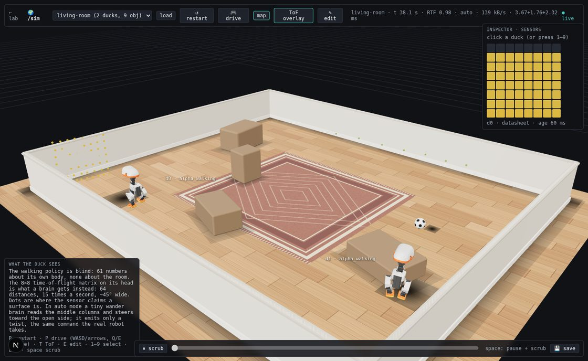 | 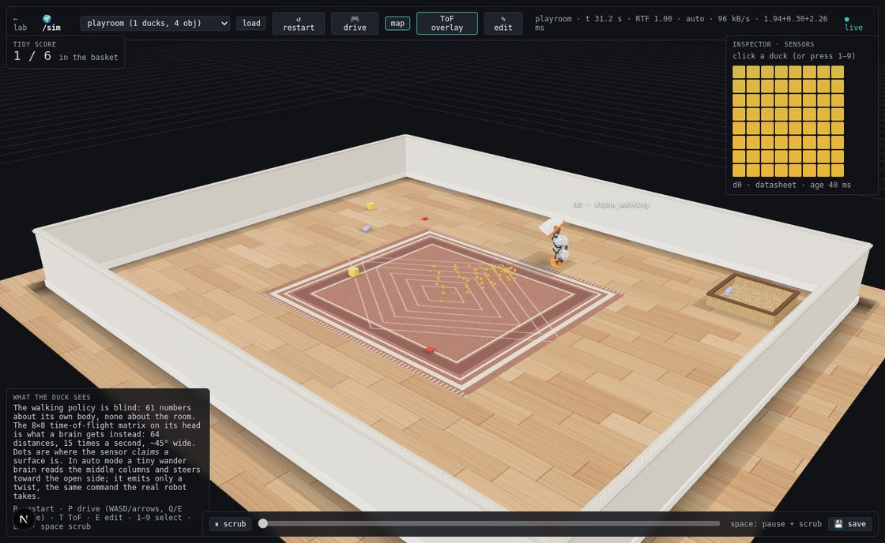 | 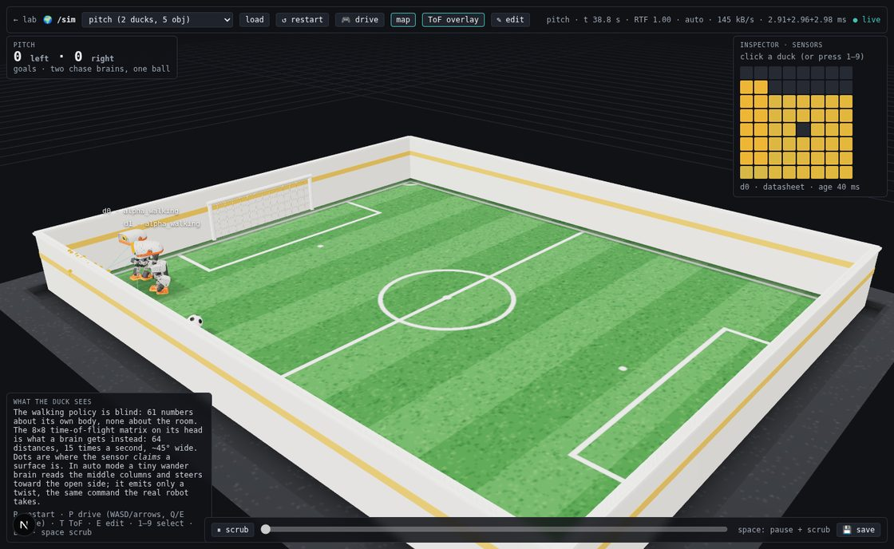 |

| 2v2 足球：追球、选脚与进球 | 玩具整理：用喙拾取并送入篮子 |
|---|---|
| 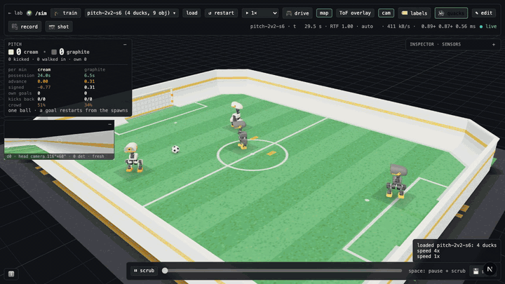 | 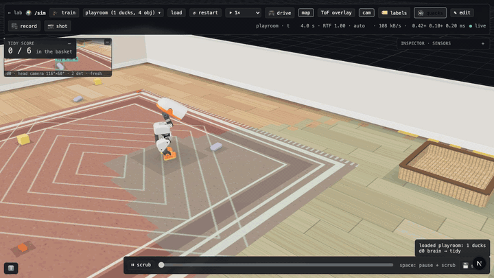 |

| 跟随队列：五只小鸭跟随 G1 | G1 前踢：编辑动作与学习结果对照 |
|---|---|
| 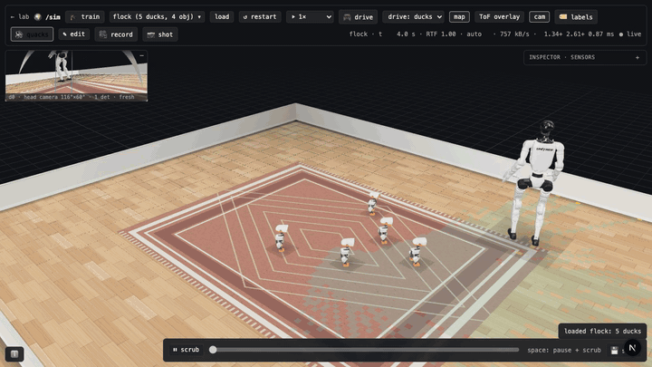 | 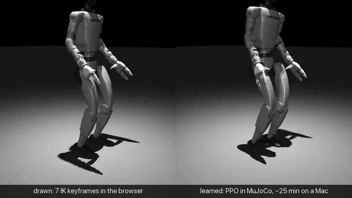 |

## 你可以在这里做什么？

| 入口 | 能力 |
|---|---|
| 实验室 `/` | 并排观察多个机器人与策略；拖动策略卡片切换模型；观察本地学员的训练快照 |
| 世界 `/sim` | 客厅、玩具房、人物跟随、1v1 / 2v2 / 3v3 足球；查看传感器、行为状态与回放 |
| 训练分析 `/train` | 大脑训练的奖励和回合长度曲线、实验矩阵与配置差异 |
| 🎓 训练 | 选择内置动作配方、查看奖励项，使用本机或兼容的云端任务训练 |
| 🎬 动作编辑 | 关键帧、脚部/手部 IK、重心编辑、动作片段保存与模仿训练 |
| 🎥 录制 | 截图、视频和 GIF；也可用命令生成世界录像、联系表与事件日志 |
| ☁ 云算力 | Colab / Hugging Face 账号与资源管理、任务状态、断开和结果下载 |

<a id="worlds"></a>
## 世界模拟：房间、感知与行为

世界模式把房间、家具、球、玩具、人物和机器人放进同一个 MuJoCo 物理世界。机器人会相互碰撞，传感器可以观察其他角色；行为层基于模拟感知驱动行走与头部动作。

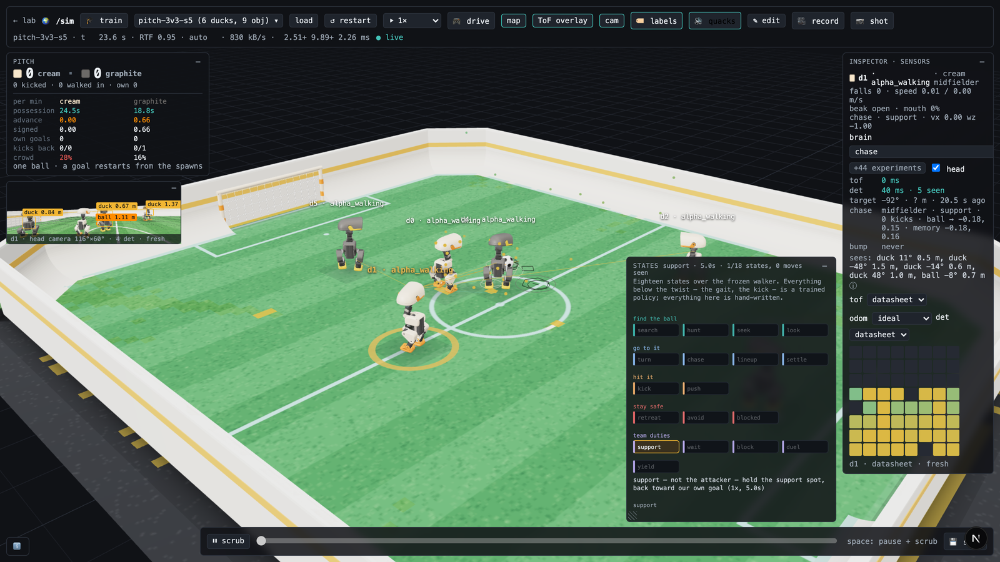

| 场景名称 | 内容与用途 |
|---|---|
| `living-room` | 客厅、家具和障碍物，观察漫游与避障 |
| `follow-me` | 跟随行走的人物，比较脚本与学习型行为 |
| `playroom` | 六个玩具与收纳篮，观察 `tidy` 的搜索、拾取、搬运和释放 |
| `pitch` / `pitch-2v2` / `pitch-3v3` | 1v1、2v2、3v3 足球对抗 |
| `flock` | 五只 MicroDuck 与一个行走的 G1，观察群体跟随 |
| `mars-playroom` / `mars-follow` | MARS 玩具房与人物跟随；整理任务可切换为 `tidy_arm` |

前六种场景内置于代码；`flock` 和两个 MARS 场景提供了可复制的 [JSON 文件](microduck_local/scenarios)。在编辑器中另存为新名称后，可以从场景菜单加载。

- **感知可视化：**查看 MicroDuck 的 8×8 ToF 深度、头部相机检测框、占据地图；MARS 使用 360° 平面 LiDAR。检查器展示观测和动作，并支持传感器噪声预设。
- **行为切换：**`wander` 漫游、`follow` 跟随、学习型跟随、`tidy` 整理、`tidy_arm` 机械臂整理与 `chase` 追球。状态图会随行为运行点亮。
- **场景编辑：**`Shift+E` 编辑墙体、箱子、机器人和人物路径，也可生成球场。
- **驾驶与回放：**`P` 接管选中角色，WASD 驾驶；空格暂停并拖动时间轴，`[` / `]` 调整速度。

| 场景编辑器 | 进球回放 | 手动驾驶 |
|---|---|---|
| 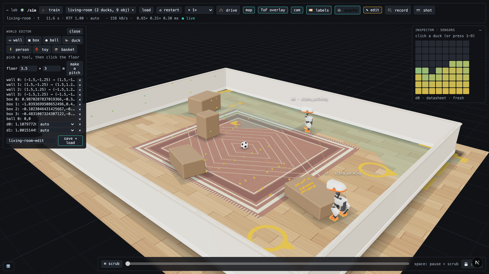 | 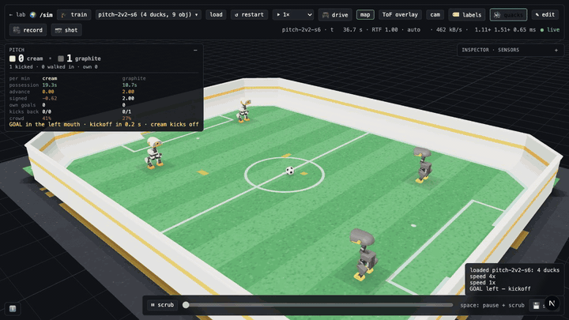 | 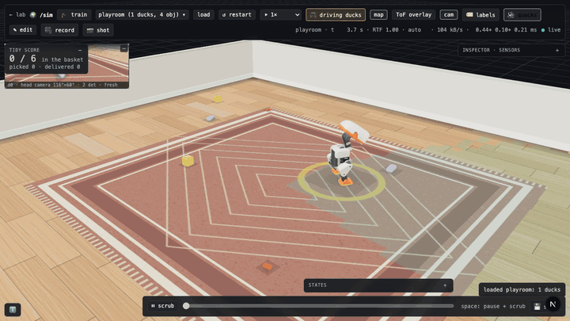 |

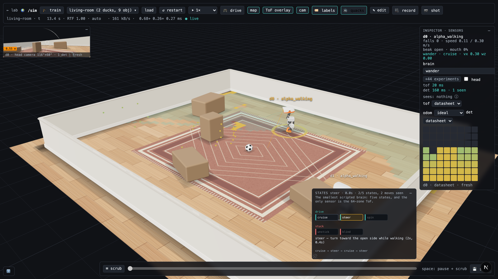

在 `microduck_local/` 中启动世界后，打开前端的 `/sim` 页面：

```bash
uv run duck-lab --world playroom
# 足球场可改用 --world pitch-2v2 或 --world pitch-3v3
```

无需打开浏览器也能记录世界。下面的命令会生成视频、画面联系表与 `events.txt`，用于回看行为切换、跌倒、拾取、释放和进球：

```bash
uv run record-world pitch-2v2 --seed 6 --seconds 60 --out /tmp/duck-pitch
uv run record-world playroom --brain d0=tidy --camera follow:d0 --seconds 90 --out /tmp/duck-tidy
```

<a id="soccer"></a>
## 机器人足球：1v1、2v2 与 3v3

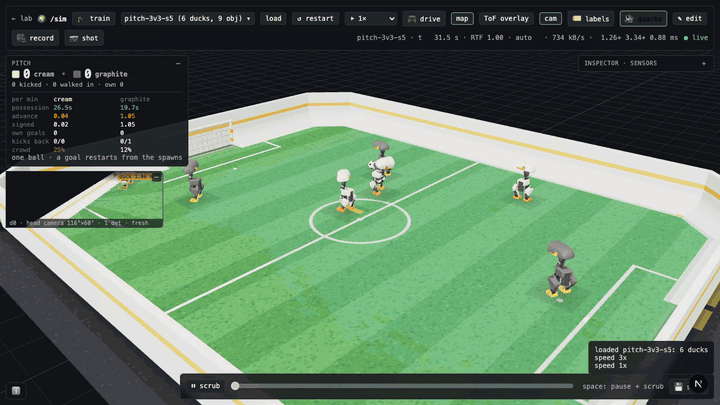

足球模式把视觉感知、追球决策、行走、踢球和团队分工接到同一场物理仿真中。

1. **阵容与角色：**1v1 直接追球；2v2 分配后卫和前锋；更大阵容加入中场。队伍根据预计到球时间选择进攻者，并抑制频繁换人。
2. **踢球选择：**比较双脚、踢球方向与测量得到的落点偏差，选择候选动作，并限制朝自家球门的射门方向。
3. **连续比赛：**进球后重新开球；通过球门柱自定位；场边弧面帮助死球回到场内。
4. **跌倒恢复：**机器人碰撞后可能跌倒，使用起身策略恢复。
5. **可量化复盘：**计分板与 `eval-pitch` 共用指标，包括控球、球的推进、反向推进、乌龙与踢球结果。

| 跌倒与自行起身 | 球场与传感器全景 |
|---|---|
| 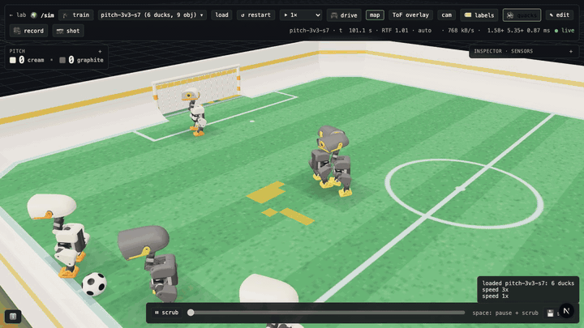 |  |

这是仍在迭代的实验环境：机器人会踢空、拥挤、转向迟缓，也可能把球带进自己的球门。演示片段不等于稳定胜率；实验结论与局限记录在[实验路线图](docs/roadmap.md)和[训练手册](microduck_local/README.md)。

```bash
# 在 microduck_local/ 中运行；相同命令可继续未完成的评估记录
uv run eval-pitch --seeds 12 --per-side 3 --out runs/my-soccer.jsonl --tag my-soccer
```

<a id="teaching"></a>
## 动作教学、关键帧与 IK

教学面板通过内置配方选择任务，展示奖励项并启动训练。本地学员的策略快照会在实验室更新；当前分支支持本地任务保存并停止，以及从已保存检查点继续训练。云端任务的中断恢复边界见下文。

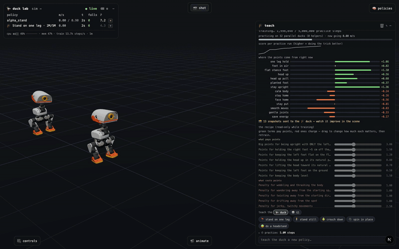

动作编辑器可以拖动脚、手和重心，编辑关键帧、接触状态及时间轴，把片段保存为 JSON，再通过模仿训练让策略尝试在物理世界里执行。示例片段位于 [`microduck_local/clips/`](microduck_local/clips)。

| 关键帧控制与动作时间轴 | 脚部逆运动学（IK） | 重心与平衡编辑 |
|---|---|---|
|  | 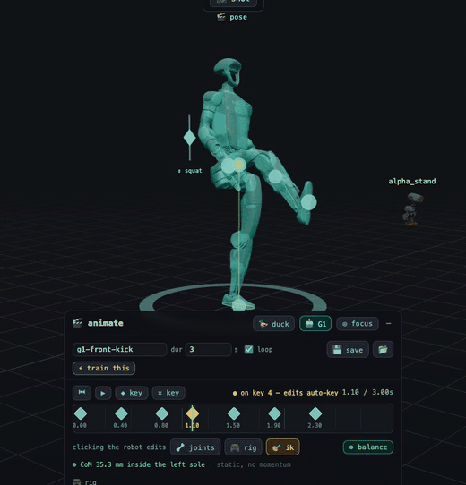 | 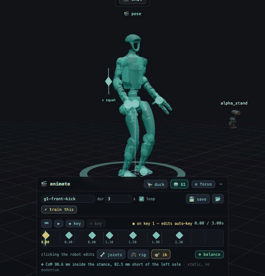 |

| 本地训练的跑步策略 | 后空翻展示：辅助起跳、策略落地、起身衔接 |
|---|---|
|  |  |

<a id="robots"></a>
## 多机器人：MicroDuck、G1 与 MARS

| 机器人 | 当前实验能力 |
|---|---|
| MicroDuck | 本地行走和动作训练、玩具整理、跟随、足球；行走部署契约为 61 维观测 / 14 维动作 |
| Unitree G1 | 29 关节人形机器人，复用训练、导出、动作编辑和实验室；在世界中作为被小鸭跟随的人物 |
| Innate MARS | 轮式底盘、机械臂和夹爪，支持 LiDAR、跟随、`tidy_arm` 整理，以及实验性的 `reach` / `pick` 训练任务 |
| MuJoCo Menagerie 模型 | 可经机器人注册机制加载模型到实验室；加载显示不代表自动具备可用控制器或训练任务 |

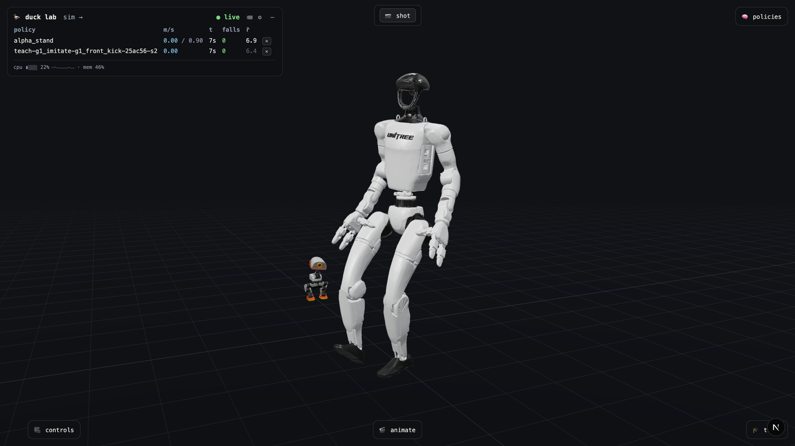

```bash
# 在 microduck_local/ 中获取所需机器人资源
uv run fetch-g1
uv run fetch-robot mars
uv run duck-lab --world mars-playroom
# 整理动作可在 /sim 检查器中切换为 tidy_arm
```

G1 与 MARS 的支持面向仿真原型。MARS 的机械臂任务仍有未达到验收标准的项目，模型惯性与硬件部署也有局限；参见 [MARS 路线图](docs/mars-roadmap.md)和[英文详细说明](README_EN.md#a-third-robot-innates-mars)。

<a id="analysis"></a>
## 训练分析、模型导出与录制

`/train` 展示 `train-brain` 运行的奖励、回合长度、平滑曲线和实验矩阵，支持查看不同运行的配置差异。实验室教学面板展示当前任务的分数与奖励分项；`/sim` 检查器展示当前机器人的观测和动作。

| 训练曲线 | 实验对照矩阵 |
|---|---|
| 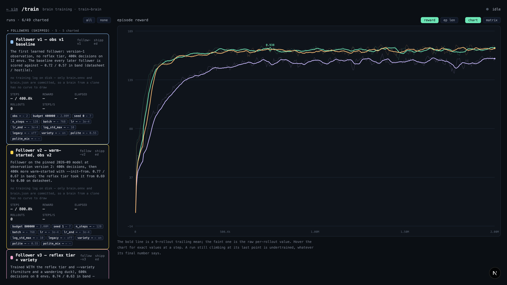 | 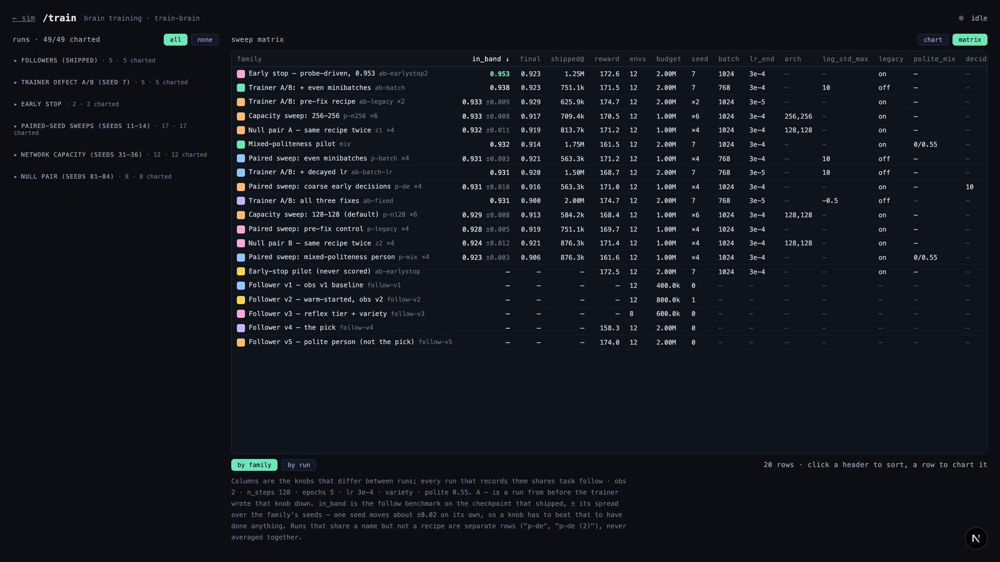 |

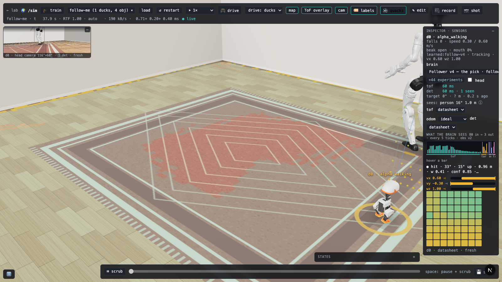

策略面板支持下载带观测归一化的 ONNX；本地训练过程可提供实时策略快照。录制面板支持 PNG 截图，以及经服务端转换的 MP4 / GIF；`render-rollout` 和 `record-world` 可生成便于逐帧检查的离线记录。


<a id="fork-features"></a>
## 相对原作者项目，增加了什么？

| 功能 | 原作者项目基础 | 本项目的升级 |
|---|---|---|
| 云端 GPU | 保留本地 CPU 训练和原有 Hugging Face 相关入口 | 在原教学流程中增加本机、Colab、Hugging Face 算力选择；使用官方 Colab CLI 调用用户自己账号下的 GPU。免费 T4 不以付费 CCU 为门槛；更高规格 GPU 检查付费余额与任务兼容性 |
| 本地训练生命周期 | 原有动作教学与快照 | 本地任务保存并停止、从已保存检查点继续训练；顶部状态栏持续显示任务进度 |
| 任务与模型 | 原有本地训练、可视化和 ONNX 工作流 | 云端任务状态、单任务停止、一键停止本项目的 Colab 会话；训练结束后下载 Checkpoint 和导出的 ONNX |
| 登录方式 | 无需 Google 账号即可使用本地功能 | 仅使用 Colab 官方授权流程；本应用不接收 Google 密码或 OAuth 令牌。每位用户使用自己的账号，免费 T4 的资源由 Google 动态分配 |
| 语言 | 原作者界面以英文为主 | 首次打开默认中文；可切换英文，选择会在浏览器保存，并在页面间同步。导航、云端流程、训练图表和主要模拟控制已有翻译 |
| 浏览器备选方案 | — | 提供 [Colab Notebook](notebooks/microduck_train.ipynb)，Windows 用户也可在 Colab 网页中运行 |

高级面板及服务器返回的部分训练配方目前仍为英文。Google Drive 自动备份、云端故障自动恢复和训练中实时 ONNX 热加载仍属后续工作。

**云端验证（2026-09-29）：**官方 Velocity 任务已在真实免费层 T4 上完成 1 次迭代，成功下载 Checkpoint 与 ONNX，并释放运行时；这是链路验收，不代表已学会行走。VelStand 需要有权限获取的教师模型，尚未完成端到端验收。详见[冒烟测试记录](docs/colab-smoke-test-2026-09-29.md)。

<a id="quick-start"></a>
## 快速开始

建议使用 macOS 或 Linux，准备好 Git、Python 3.12、[`uv`](https://docs.astral.sh/uv/) 和 Node.js。安装脚本会拉取项目依赖、原作者依赖的机器人模型和参考策略：

```bash
git clone https://github.com/heranhe/microduck-lab-cloud.git
cd microduck-lab-cloud
./scripts/setup.sh
```

在一个终端启动本地实验室：

```bash
cd microduck_local
uv run duck-lab
```

在另一个终端启动浏览器界面：

```bash
cd microduck-lab-cloud/duck-viewer
npm run dev
```

打开终端显示的本地地址。点击实验室右上角的「🎓 训练」，先在原教学面板选择动作，再选择本机、Google Colab 或 Hugging Face，最后用面板底部唯一的“开始训练”按钮提交。「☁ 云算力」只负责账号、可用资源、任务状态和断开操作。训练开始后，顶部常驻状态栏统一显示算力来源、运行时长和安全停止按钮：本地任务支持“保存并停止”，云端任务显示“一键断开”。实验室、本地训练和模拟页面**无需 Google 登录**。在界面顶部切换「中文 / EN」，再次访问时会保留选择。更完整的命令、性能测量和原作者功能说明见 [English guide](README_EN.md)。

<a id="cloud"></a>
## 使用 Google Colab GPU

云端训练运行的是 Pollen Robotics 官方 [`microduck_rl`](https://github.com/pollen-robotics/microduck_rl) GPU 训练栈，而非把本地 CPU 训练代码直接搬到 Colab。Colab 的费用、GPU 供应和账号权益由 Google 管理；本项目只管理它启动的任务。

💡 **免费账号也可尝试 T4**，即使 `colab usage` 显示 `Current balance: 0.00`。这不是“剩余免费小时数”的显示；免费 GPU 的可用性与会话时长由 Google 动态决定。付费权益、GPU 型号和实际扣费率请以自己的 [Colab 账号](https://colab.research.google.com/)与 [官方 FAQ](https://research.google.com/colaboratory/faq.html)为准。

1. 在 `microduck_local` 目录安装依赖并查看账号状态：

   ```bash
   cd microduck_local
   uv sync
   uv run colab usage
   ```

2. 首次使用时，按官方 Colab CLI 给出的链接完成 Google 授权。`Current balance: 0.00` 不妨碍选择免费层 T4；它只表示没有可用的付费计算单元。授权凭据留在本机 CLI 中，不会提交到本仓库，也不会传给本应用。
3. 启动 `duck-lab` 和前端，点击「🎓 训练」，在教学面板选择一个动作，再把训练算力切换为 Colab，选择 GPU、迭代次数和并行环境数后提交。当前只有能与官方 `microduck_rl` 任务准确对应的动作会开放云端提交；其他本地动作不会被静默替换成不同任务。旧的 `/cloud` 地址会自动回到云算力管理面板。
4. GPU 分配成功后，实验室右上角常驻显示实际 GPU 名称、显存和已使用时长，并提供「一键断开」按钮。计时从分配成功时起计算，**不等于 Google 的实际计费时长**。任务列表也可单独断开任务；成功导出后下载 `policy.onnx`。正常关闭实验室时，服务端同样会尝试释放仍由本项目管理的会话。

若没有付费 CCU，本项目会允许提交 T4 请求；**这不保证 Google 一定分配 GPU**。免费会话可能因配额、资源紧张或使用限制而被回收，也没有固定的 3–5 小时保证。L4、A100 和 H100 在本项目中要求付费计算单元。Windows 用户可在 Colab 网页打开 [训练 Notebook](notebooks/microduck_train.ipynb)；它不依赖本地 Colab CLI。

“账号已连接”只代表 CLI 授权成功。付费权益的 CCU 与免费层动态资源分别显示和使用；若您预期有 Google AI Pro 付费权益但 CLI 显示 `0.00`，请在 Colab 网页核对账号与订阅，不影响先尝试免费 T4。

## 使用 Hugging Face Jobs

在「☁ 云算力」中切换到 Hugging Face，粘贴具有 Jobs 和模型写入权限的细粒度 Token。Token 仅保存在本机并以 Jobs Secret 传给训练容器；浏览器再次读取时只能看到掩码。面板会从 Hugging Face 实时读取可用 GPU、显存和价格。连接完成后回到「▶ 开始训练」，选择动作与 Hugging Face 算力卡后统一提交。训练结果上传到账号下的私有 `microduck-cloud-results` 模型仓库，再由本地实验室提供 ONNX 下载。顶部计时和「一键断开」同样覆盖本项目创建的 HF Jobs。

### 当前云端功能边界

- 最终 Checkpoint 和 ONNX 在训练结束后下载；训练过程中的文件不会自动同步到 Google Drive。
- 网络中断或 Colab 主动回收运行时后，任务不会自动从上一次 Checkpoint 接续。
- 3D 界面目前不支持每 30 秒加载云端临时 ONNX；也不保证 12–24 小时持续运行。
- 云端导出的策略在用于真实机器人前，仍需按原项目的仿真到现实流程评估。

## 仿真到现实与进一步阅读

本地训练用于快速验证奖励、观测和课程设计。真实机器人部署仍需使用官方训练与验证流程；保持 ONNX 接口兼容不等于已经具备实机安全性或可靠性。

| 文档 | 内容 |
|---|---|
| [英文完整指南](README_EN.md) | 原项目的详细功能、性能数据与实验背景 |
| [训练手册](microduck_local/README.md) | 本地训练命令、评估方法和已知局限 |
| [浏览器架构](duck-viewer/README.md) | 实验室、世界页面与可视化实现 |
| [世界模拟路线图](docs/sim-roadmap.md) | 场景、传感器和行为框架 |
| [实验路线图](docs/roadmap.md) | 足球与其他实验的测量、结论和待办 |
| [项目约定](AGENTS.md) | 工作区结构与验证纪律 |

## 项目结构

| 路径 | 内容 |
|---|---|
| `microduck_local/` | 本地训练、`duck-lab` 服务端、Colab 任务管理 |
| `duck-viewer/` | Next.js 浏览器界面和语言切换 |
| `notebooks/` | Colab 网页训练备选方案 |
| `docs/` | 原作者的实验记录、路线图和媒体素材 |
| `scripts/setup.sh` | 工作区依赖安装脚本 |

## 来源与许可

本项目沿用原作者项目及其 [Apache-2.0 许可证](LICENSE)。原作者仓库：[jonathanhawkins/microduck-lab](https://github.com/jonathanhawkins/microduck-lab)。本分支新增功能的范围见上方对照表；代码变更可在 Git 历史中逐项查看。
