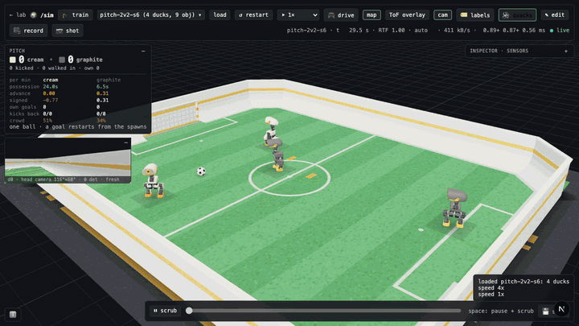
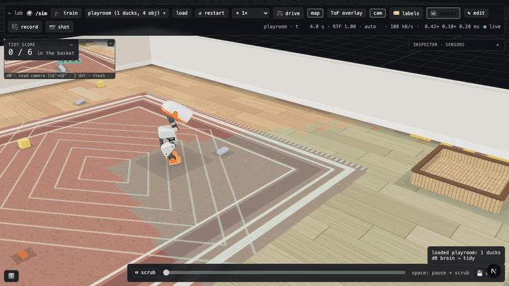
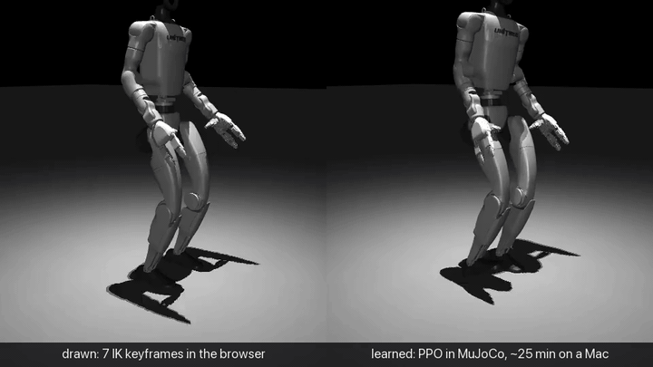
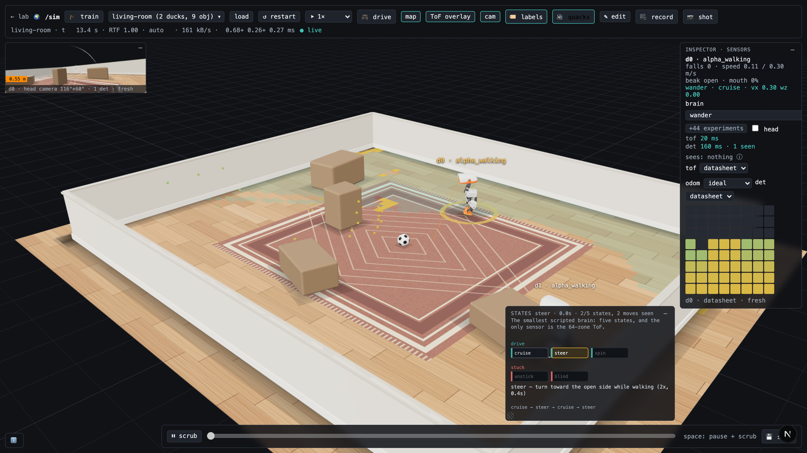
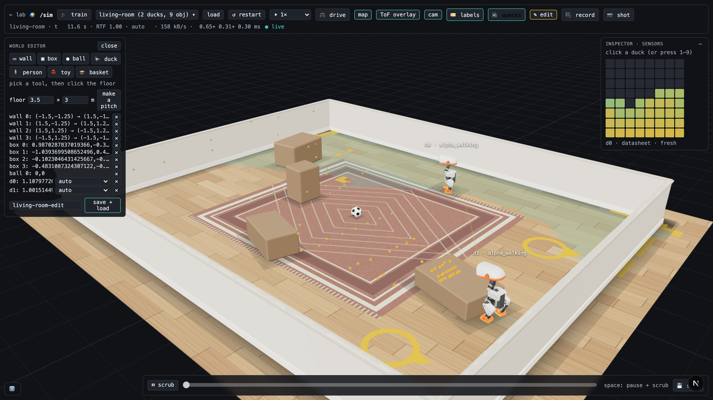
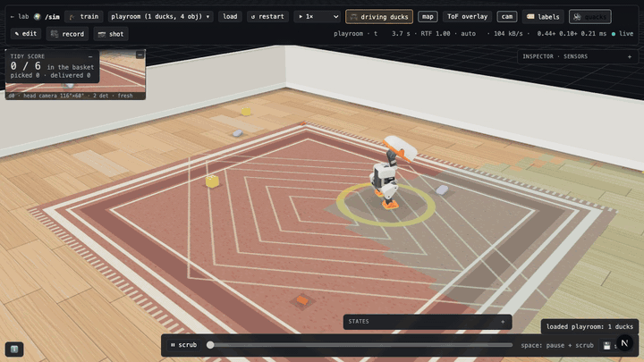
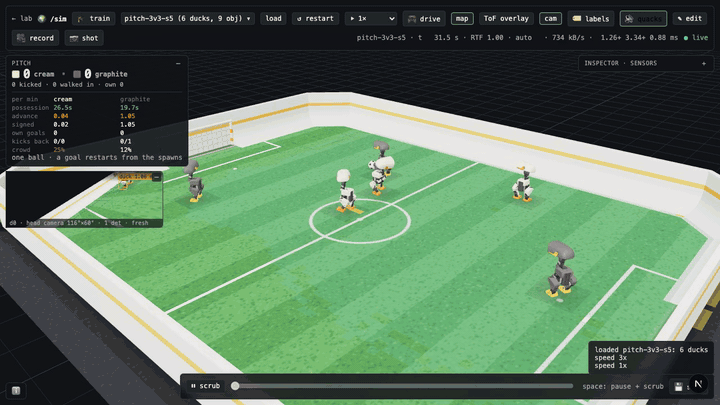
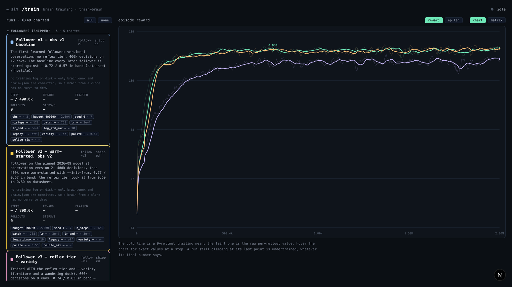
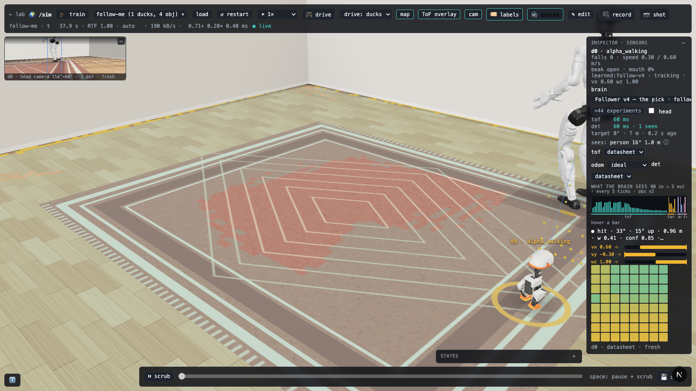

<div align="right">
  <a href="README.md">English</a> | <strong>简体中文</strong>
</div>

# Microduck Lab Cloud 🦆☁️

面向 [Microduck](https://pollen-robotics.com/microduck) 双足机器人的高阶强化学习实验、云端训练工作流与交互式 3D 仿真套件。

[](https://opensource.org/licenses/Apache-2.0)
[](https://www.python.org/downloads/)
[](https://nextjs.org/)

> **Microduck Lab Cloud** 在 [microduck-lab](https://github.com/jonathanhawkins/microduck-lab) 原生架构的基础上进行了深度拓展与融合：扩展了丰富的强化学习敏捷行为动作库（白鹤亮翅、单腿跳跃、90°跳跃转身、爆发远跳）、支持中英双语一键切换的 Web 3D 实时仿真交互界面、全栈机器人身体注册表（支持宇树 Unitree **G1** 人形机器人与 Innate **MARS** 轮臂复合机器人）、交互式反向运动学 (IK) 动作绘制，以及 **Google Colab 云端多卡（T4/L4/A100/H100）算力调度与计费安全熔断看板**。

### 🆚 相比原版（microduck-lab）的核心演进与区别

| 核心维度 | 原版 `microduck-lab` | 本项目 `microduck-lab-cloud` 增强版 |
| :--- | :--- | :--- |
| **🌐 语言支持** | 仅纯英文界面与文档 | **全栈中英双语支持**：Web 3D 界面、遥测控制面板、教学技巧菜谱及完整文档支持一键中英文即时切换。 |
| **☁️ 云端算力调用** | 仅支持本地 Mac CPU / 基础 MPS，受限于本地散热与显存 | **集成 Google Colab / Google AI 算力调度引擎**：可直接在界面选择调用 **NVIDIA T4、L4、A100、H100** 等云端加速芯片，打破本地硬件算力天花板。 |
| **⏱️ 训练时长保障** | 受限于本地笔记本续航与发热，通常仅用于几分钟的原型速测 | 单任务支持长达 **12 ~ 24 小时**的稳定超长周期强化学习训练，配备多阶段 Checkpoint 保存与故障自愈。 |
| **🚨 成本与安全熔断** | 无云端实例生命周期管理与成本显示 | **实时时长看板 + 一键安全熔断（Kill-Switch）**：实时监测云端运行时间与预估成本；专设安全熔断开关，一键强制销毁并释放所有计费 GPU 实例，彻底杜绝扣费失控。 |
| **📡 远端实时反向流** | 仅本地 Socket 通信 | **30 秒实时热流加载**：远端训练时每 30 秒自动回传 `live.onnx` 快照并在本地 3D 视口实时更新动作；训练完成自动双重归档至 Google Drive。 |
| **🥋 敏捷动作扩展** | 基础行走、小跑与后空翻 | **新增敏捷高难动作库**：白鹤亮翅（单腿悬停平衡）、单腿连续跳、90°腾空跳跃转身、高爆发向前远跳及配套动作 Clips。 |
| **🤖 多机器人与世界仿真** | 纯双足小鸭单体环境 | **完整融合多鸭世界模拟器 (`/sim`)**：支持 1v1/2v2/3v3 足球赛、收拾玩具房间、Unitree G1 人形机器人（29关节）以及 Innate MARS 轮臂机器人。 |

---

无需专业工作站显卡，不仅可在 **Apple Silicon Mac 本地** 运行，更能一键调度 **Google Colab 云端 GPU 实例**，高效训练 ~25 cm 开源双足机器人 Microduck 的强化学习控制策略。在浏览器中实时观察每个智能体的行走、学习过程与敏捷动作——接着把它们放进一个具备模拟感知与大脑决策的完整房间中，看它们自主跟随人类、收拾玩具房，或来一场 3v3 足球对抗赛。本项目同一套训练基座还同时驱动着另外两款机器人：宇树（Unitree）的 **G1** 双足人形机器人，以及由 [Innate](https://www.innate.bot) 研发的 **MARS** 轮臂复合移动机器人。


| 本地 CPU 训练步态（结合 BAM 真实舵机物理动力学） | 后空翻展示：辅助弹射、策略着陆与手持交接 |
|---|---|
|  |  |

| `/sim` 机器人足球赛：2v2 角色分工、射门动作选择器与计分板 | `/sim` 玩具房收拾：发现玩具、用嘴喙夹起并投放到收纳篮（2倍速） |
|---|---|
|  |  |

| 第二款机器人：Unitree G1 踢腿，在浏览器中通过 **IK 绘制**，再由**物理策略学习** | 鸭群跟随：五只小鸭紧紧跟随行走的 G1（2倍速） |
|---|---|
|  |  |

---

## 2026年9月重大更新特性

- **[`/sim` 仿真世界页面](#sim-仿真世界房间感知与大脑决策)**：在单个 MuJoCo 模型中模拟完整房间，内置机器人仿真感知系统（8×8 ToF 深度矩阵、摄像头目标检测器、带有漂移的里程计）、顶层大脑决策逻辑、交互式场景编辑器、可前后拖动的时间轴以及无头批量录制管线。
- **[机器人足球对抗赛](#机器人足球赛-1v1-2v2-3v3)**：支持 1v1、2v2 与 3v3 绿茵赛场。支持动态队伍角色分工、射门策略筛选器、微调射门姿态、开球规则、实时比分统计——跌倒的小鸭不会被瞬间瞬移，而是通过真实的起身策略自主站立重返赛场。
- **全新高阶行为动作**：深度学习驱动的人形跟随大脑（Follower）、收拾房间玩具闭环（用鸭嘴将地面玩具搬运至篮子）、自动寻球避障与倒地爬起。
- **[第二款机器人：宇树 Unitree G1 人形机器人](#第二款机器人宇树-unitree-g1)**：拥有 29 个自由度关节的双足人形机器人。在同一实验套件中完成训练、导出、渲染与同台站立——并在 `/sim` 世界中作为被小鸭跟随的向导。
- **[第三款机器人：Innate MARS 轮臂复合机器人](#第三款机器人innate-mars-轮臂机器人)**：轮式差速底盘 + 5关节机械臂抓夹，8 秒极速检出。能在房间内自由巡航，使用 360° LiDAR 扫描建图，并用机械爪精准收拾房间——5 分钟内收拾玩具效率达到 **94%**（相比小鸭的 83%）。基于全新的 `Body` 身体抽象注册表，摆脱硬编码；同时支持直接加载 MuJoCo Menagerie 动物与机器人资产库（如 `fetch-robot menagerie:unitree_go2`）。
- **[🎬 动画编辑面板支持 IK（反向运动学）](#动画编辑通过关键帧制作动作并物理实现)**：同时支持小鸭与 G1。直接拖拽足底、手掌或**身体质心 (CoM)**，算法自动实时逆向求解所有关节角度。仅用 7 个手绘关键帧便“画”出原本探索了一整天都无法收敛的 0.62 米 G1 高踢腿动作，再交由模仿学习物理复现。
- **[`/train` 训练指标图表面板](#train-大脑训练指标与对比看板)**：全景展示大脑训练回合奖励、步长衰减曲线，以及多运行超参数扫参对比矩阵。
- **☁️ 云端 GPU 算力调度与安全看板**：前端新增专用「云算力账户」弹窗，可在 NVIDIA T4、L4、A100、H100 之间一键切换；实时显示算力消耗时长与成本预估；配备一键熔断销毁按钮，防止云端扣费超支。

官方的 [microduck_rl](https://github.com/pollen-robotics/microduck_rl) 依赖 MuJoCo Warp 并且必须配备高端 CUDA GPU。而本项目旨在利用手头现有的笔记本电脑或云端服务器快速构建原型。它与官方完全共享同一个 MJCF 机器人几何与动力学模型、相同的 **61 维观测 (Observations) / 14 维动作 (Actions)** 部署接口契约，以及标准的 50 Hz 控制频率。在本项目中设计的全新行为，可以直接无缝迁移到官方 Sim2Real 流程中，导出的 ONNX 模型也可直接被官方工具链加载使用。

*声明：本项目为独立开源衍生项目，不隶属于 Pollen Robotics、Innate 或 Unitree。G1 与 MARS 模型在构建时通过固定 SHA 直接从其官方开源仓库检出，本项目内部未包含未经授权的专有权重。*

---

## 包含的模块与开箱功能

- **`microduck_local/`**：基于 CPU-MuJoCo + Stable Baselines 3 PPO 的高性能强化学习训练框架
  - `train-walk` / `train-behavior`：速度控制行走训练与丰富的可教导技巧动作库，集成 mjlab 蒸馏奖励、动作对称性增强、观测标准化与惩罚符号守卫
  - **✨ 新增敏捷高难行为库 (Agile Behaviors)**：
    - 🕊️ `white_crane`（白鹤亮翅）：动态单腿离地平衡、抬腿悬停与高稳定性上身姿态控制
    - 🦿 `single_leg_hop`（单腿跳跃）：连续动态单腿跳动与触地缓冲自适应控制
    - 🔄 `jump_turn`（跳跃转身）：腾空 90 度偏航旋转并在触地瞬间平稳消解角动量
    - 🦘 `long_jump`（向前远跳）：高爆发前向腾跃与安全抗冲击受力着陆
  - **☁️ 云端训练与自动化管线**：
    - `colab_runner.py`：支持在 Google Colab 或远程 Linux 服务器上一键分流启动训练
    - 多显卡规格支持：自动根据用户在 UI 选择的 **T4、L4、A100、H100** 配置远程环境
    - `train/colab/kill-all`：一键释放所有远程运行容器，彻底杜绝闲置扣费
    - `goal_training.py` & `search_hop.py`：目标导向的自动化多阶段课程超参数搜索与奖励函数调优
  - **两套舵机执行器动力学模型**：
    - 极速线性化 XML 舵机模型
    - 高保真 BAM XL330 电压饱和动力学模型（经 Numba JIT 加速），针对高爆发及饱和极限动作
  - `export-walk`：将策略导出为部署级 ONNX 模型（内置 Observation Normalizer 归一化层）
  - `eval-walk`：无头自动化评估套件（跌倒率、指令跟踪误差）
  - `render-rollout`：生成高清 MP4 视频，以及**携带每帧身体高度、倾角和足底接触力标签、可直接供 AI 编码助手读取的接触表 (Contact Sheet)**（[示例](docs/media/contact-sheet.png)）
  - `bench-walk` / `bench-envs`：自动基准测试，为你当前机器匹配最高吞吐量的并行环境数
  - **仿真世界模式** (`duck-lab --world playroom`)：房间、足球场、人物、玩具与 N 只小鸭组合成单个 MuJoCo 物理模型；`sensors/` 仿真传感器（头部 8×8 ToF 矩阵、摄像头检测、里程计，提供 `ideal` / `datasheet` / `hostile` 噪声档位）；`brain/` 决策层将传感器输入转化为小鸭的 `robot.move` 与 `robot.head` 意图
  - `record-world`：在固定随机种子下无头录制任意世界场景，输出 MP4、带标签接触力图表以及包含时间戳的事件日志
  - `eval-tidy` / `eval-pitch` / `eval-brain`：可断点恢复的标准化基准测试工具
  - `train-brain`：在冻结的底层行走策略之上，通过 PPO 训练高层决策大脑（如人形跟随）
  - `--robot g1` / `--robot mars`：通用 `Body` 身体抽象注册表（位于 [`robots/`](microduck_local/src/microduck_local/robots)），同时支持 29 关节 Unitree G1、Innate MARS 轮臂机器人及 MuJoCo Menagerie 资产
- **`duck-viewer/`**：基于 Next.js 15 + React Three Fiber 的现代化 3D 查看器（包含三大核心页面）
  - **🌐 中英双语一键切换**：支持在中英文界面间自由切换，涵盖遥测仪表盘、控制面板和技巧菜谱
  - **`/` 实验室主页**：多台机器人同台实时仿真（25 Hz WebSocket），支持拖拽策略芯片直接在运行中热替换“大脑”
  - **`/sim` 仿真世界主页**：同一个房间、多只小鸭同台竞技与交互，实时探查每只机器人的感知和大脑状态
  - **`/train` 训练看板主页**：大脑训练回合指标与超参数对比矩阵
  - **🎓 教学面板 (Teach Panel)**：通过自然语言或关键词选择预设技巧（例如“单腿站立”），查看纯英文/中文描述的奖励项构成；每 ~15 秒快照热加载，支持直接拖动滑块实时调节奖励权重，无需修改 Python 代码
  - **🎬 动画面板 (Animate Panel)**：内置关键帧姿态编辑器、控制骨架与 **IK 反向运动学求解器**。在浏览器中可视化编辑动作片段，点击“训练此动作”即可通过强化学习使其物理可执行
  - **🎥 捕获面板 (Capture Panel)**：📷 一键导出无干扰高清 PNG 截图；🎥 电影级运镜跟踪录制，自动生成高质量 MP4 和 GIF 动图，方便直接贴入 Issue 或 PR
  - **⤓ 一键下载 ONNX**：直接下载包含归一化器的完整端到端神经网络权重，训练中支持实时热拉取 `live.onnx`
  - **☁️ 云算力账户管理**：点击导航栏「云算力账户」按钮，直观完成 Google 账号一键授权、显卡型号下拉切换、实时运行时长与计费预估监控，以及一键紧急熔断

---

## 快速上手 (Quick Start)

### 环境依赖
* 操作系统：macOS（推荐 Apple Silicon M 系列芯片）或 Linux
* 基础工具：[uv](https://docs.astral.sh/uv/)（现代高性能 Python 包管理工具）、Node.js 20+
* 磁盘空间：约 3 GB 用于依赖项及官方模型检出

```bash
# 1. 克隆本项目并进入目录
git clone https://github.com/heranhe/microduck-lab-cloud.git && cd microduck-lab-cloud

# 2. 一键自动化脚本安装（或按下方手动执行）
./scripts/setup.sh

# 手动安装步骤如下：
git clone https://github.com/pollen-robotics/microduck        # 机器人官方硬件与文档
git clone https://github.com/pollen-robotics/microduck_rl     # 官方 MJCF 动力学模型与基准
cd microduck_local
uv sync
# 下载官方发布的预训练基准策略至 ../microduck/policies/
uv run hf download pollen-robotics/microduck-policies \
  alpha_walking.onnx alpha_stand.onnx alpha_sitstand.onnx alpha_ground_pick.onnx \
  ball_kick_left.onnx ball_kick_right.onnx roller.onnx roller_crouch.onnx roulade.onnx \
  --revision 088524a64e2557dc453256b6071dbb9d23888802 --local-dir ../microduck/policies --quiet
uv run --with pytest pytest tests/   # 验证单元测试与接口契约

# 3. 训练你的第一个行走策略 (在 M 系列 Mac 上仅需数分钟)
uv run train-walk --envs 32 --steps 3_000_000 --run-name first-gait
uv run export-walk runs/first-gait
uv run eval-walk runs/first-gait/policy.onnx

# 4. 启动流式后端与 Web 3D 查看器
uv run duck-lab runs/first-gait ../microduck/policies/alpha_walking.onnx
cd ../duck-viewer && npm install && npm run dev
```

直接在浏览器中打开打印的链接（默认为 `http://localhost:63317`）。

### 直接体验仿真世界（无需预先训练）

```bash
# 启动 2v2 足球赛场景（或选择 playroom、follow-me、living-room、pitch-3v3、flock 等）
uv run duck-lab --world pitch-2v2
# 访问 http://localhost:63317/sim 即可直接观看足球比赛

# 可选：下载 Unitree G1 人形机器人模型 (~140 MB)
uv run fetch-g1

# 可选：下载 Innate MARS 轮臂机器人模型 (7.2 MB)
uv run fetch-robot mars
```

---

## 性能表现 (在 Apple M 系列芯片实测)

详细测试方案与所有对比实验可参考 [`microduck_local/README.md`](microduck_local/README.md)：

- **~16,500 仿真步/秒 (env-steps/s)**：在默认 32 环境配置下，每训练 100 万步仅需约 1 分钟；峰值吞吐量可达 27k 步/秒
- **共享编译 MuJoCo 模型**：采用 fork + 写时复制 (Copy-on-Write) 机制，64 并行环境的内存占用从 **41 GB 直降到 1.5 GB**
- **低延迟 IPC 通信**：使用基于信号量 (Semaphore) + 共享内存的 IPC，替代传统的 pipe/pickle 序列化开销
- **Numba JIT 融合 BAM 驱动模型**：实现与 Numpy 参考实现逐位精度完全一致的高性能物理执行器模拟
- **自适应 MPS 硬件加速**：智能判定在有吞吐增益的阶段自动启用 Apple Silicon GPU (MPS) 进行 PPO 权重更新

---

## 训练自定义技能与动作 (Teach Panel)

所有技能动作都以明晰的代码化奖励配方组织在 [`microduck_local/src/microduck_local/behaviors/`](microduck_local/src/microduck_local/behaviors) 中。一个 `Behavior` 包含：
1. 一组清晰可解释的奖励项（Reward Terms）
2. 触发关键词
3. （可选）针对高难度动作的多阶段课程调度（Curriculum）

教学面板目前内置了 **27** 种精选动作配方（涵盖小鸭的踢球、平衡、自研高难动作、G1 专属任务及 MARS 机械臂任务）。在界面中输入“单腿站立”或选择对应动作，即可实时观察小鸭每 15 秒加载的最新策略快照，并拖动滑块动态调节奖励权重，无需编写任何 Python 代码。

---

## 动画编辑：通过关键帧制作动作并物理实现 (Animate Panel)

在 🎬 动画编辑面板中，你可以像专业 3D 动画师一样直观设计动作轨迹：


- **直观姿态拖拽**：直接点击机器人身体部位拖动，或使用特制的 **🎮 控制骨架 (Control Rig)**（`squat` 下蹲、`lean` 俯仰、`sway` 侧摆、`stance` 开合、`twist` 扭腰等）。控制轴正交设计，确保调节单一关节时不破坏机器人的双足接地基础。
- **🎯 IK 反向运动学**：直接拖拽小鸭或 G1 的手、脚或**身体质心 (CoM)**，算法基于阻尼最小二乘法实时求解整条运动学链的关节角度，同时严格受限于物理关节限位。界面上还配有实时质心平衡投影线，与双脚接触面比对，绿色即代表当前姿态在静态下可自保持平衡。

  | 拖动**质心 (CoM)**：臀部平移，双脚固定，平衡读数实时变绿 | 拖动**足底**：踢腿最高点关键帧一键求解关节解 |
  |---|---|
  |  |  |

- **多机器人切换**：面板根据 `RobotSpec` 动态自适应，同样无缝支持 Unitree G1 的 12 组宏控制柄。
- **时间轴与关键帧**：支持自动打帧、时间轴快进/回放与循环动画；所有生成的姿态片段以 JSON 格式保存在 `microduck_local/clips/`。
- **⚡ 训练此动作 (DeepMimic 模仿学习)**：将设计好的动作片段作为奖励参考。利用模仿学习，将像“后空翻”这种极具难度的全空间盲目搜索转变成易于收敛的轨迹跟踪问题，且依然完全兼容 61 维部署契约。

---

## 画面捕获与分享 (Capture Panel)

查看器内置强大的录屏与截图工具，无需第三方录屏软件：


- **📷 截图 (Shot)**：一键抓取全分辨率清晰 PNG，自动隐去高亮选择光圈，便于撰写技术报告。
- **🎥 运镜录像 (Record)**：智能摄像机自动平滑滑行到小鸭前方 ¾ 视角，以微弱缓动保持视觉张力，同时使用 WebGL 画布录制流捕获纯净画面（界面 UI 与 DOM 悬浮层不会遮挡画面）。
- **自动转码**：录制完成上传至后端服务自动转码为高质量 H.264 **MP4** 以及调色板优化的 **GIF** 动图，一键下载直接贴入 GitHub PR。录制时长上限为 60 秒。

---

## `/sim`：仿真世界、房间、感知与大脑决策

在单一私有环境之外，**世界模式 (World Mode)** 将整个房间打包为一个完整的 MuJoCo 模型——墙壁、家具、足球、玩具、行走的人类向导、N 只小鸭——机器人之间拥有真实的刚体碰撞，传感器能相互观测彼此。在行走策略之上，运行着真实机器人的全套软硬件感知与大脑栈：


```bash
uv run duck-lab --world playroom      # 访问 http://localhost:63317/sim
```

- **预置世界场景与场景编辑器**：内置 6 个场景（`living-room` 客厅、`follow-me` 跟随、`playroom` 玩具房、`pitch` 1v1、`pitch-2v2`、`pitch-3v3`）。此外还在 `microduck_local/scenarios/` 下提供了 `flock.json`（五鸭跟随 G1）、`mars-playroom.json`、`mars-follow.json`。按下 **`Shift+E`** 可直接打开场景可视化编辑器（放置墙体、箱子、小鸭、绘制人类行走巡逻路线）。
- **可视化传感器读数**：按下 **`T`** 可视化显示测距传感器（小鸭 8×8 ToF 深度矩阵或 MARS 360 线激光雷达）；按下 **`V`** 打开小鸭头部摄像头，带有实时目标检测边界框（检测小鸭、人类、足球、玩具、收纳篮、球门柱）；按下 **`M`** 显示机器人实时构建的栅格占用地图；按下 **`I`** 打开检查器，在 `ideal`（理想）与 `hostile`（恶劣环境噪声）预设间一键切换。
- **自主大脑层 (Brains)**：内置 `wander`（避障漫游）、`follow`（程序化跟随）、`learned:follow-v4`（强化学习端到端训练的跟随大脑）、`tidy`（收拾玩具）、`tidy_arm`（MARS 机械臂收拾）、`chase`（足球追逐）。按下 **`G`** 可视化展示当前大脑的状态机或计算图流转。

  

- **主动介入接管**：按下 **`P`** 可通过 WASD 键直接键盘遥控选中的小鸭，或“附身”人类向导带领小鸭队伍在房间中巡游。
- **时间控制与时间轴倒放**：**`[` / `]`** 可在 0.25x 到 8x 之间调整仿真速率；**`空格键`** 暂停并呼出可前后拖动的时间轴，利用 `←/→` 可逐帧倒放分析机器人跌倒或进球瞬间。

  | 场景编辑器 (`Shift+E`) | 倒放进球瞬间：`空格` 然后 `Shift+←` | 键盘遥控接管：`P` 然后 WASD (2倍速) |
  |---|---|---|
  |  |  |  |

- **玩具房收拾整理任务**：`tidy` 大脑扫描识别地面的积木玩具，小跑靠近，俯身并合拢嘴喙（第 15 个伺服电机实现真实物理夹持），叼起玩具搬运至收纳篮并松开后退——在 `eval-tidy` 基准测试中，5 分钟内可整理完成 5/6 的玩具。

---

## 机器人足球赛：1v1, 2v2, 3v3



分为两支队伍（奶白队 vs 石墨灰队），争夺一颗足球，使用各自真实的相机与 ToF 感知，不依赖任何全局作弊数据：

- **根据阵容自动分配角色**：1v1 为全场追逐；2v2 自动分配一名后卫与一名防守前锋；3v3 引入中场调度。队伍黑板机制根据预估的“到达球所需时间”决定谁执行控球进攻，带有滞后滤波防止频繁摇摆。
- **射门动作动态选择器**：根据双脚位置、射线扇区预测以及射门球路离散度，自动筛选最佳出球动作，并带有防乌龙射门角度钳位保护。
- **物理互动球场**：进球后自动重置开球点，通过球门柱进行视觉自主定位。场地边缘设有 15 cm 的物理弧形斜坡，确保死角皮球能自然滚回场内，彻底无需“裁判瞬移”。
- **跌倒真实爬起**：被撞倒的小鸭会触发官方 `alpha_stand` 真实策略自主爬起，而非凭空复活。

  

- **专业计分板指标**：控球率、每分钟向前推进距离、净推进米数、乌龙球统计、回传统计等，与无头基准测试工具 `eval-pitch` 保持完全一致。

---

## 第二款机器人：宇树 Unitree G1 人形机器人


底层通过通用 [`robots/spec.py`](microduck_local/src/microduck_local/robots/spec.py) 抽象规范解耦，使得小鸭的全部测试无缝保持一致的同时，29 关节、1.3 米高的 [Unitree G1](https://www.unitree.com/g1) 能够完全复用整套训练器、导出器、渲染管线、查看器及 🎬 动画编辑面板：

```bash
uv run fetch-g1                                  # 下载 MJCF + 3D 网格 + 预置 walker.onnx
uv run distill --robot g1 --teacher .cache/unitree_g1/walker.onnx --run-name g1-clone
uv run train-walk --robot g1 --envs 32 --init-from runs/g1-clone --run-name g1-walk
uv run export-walk runs/g1-walk                  # 99 维观测输入 -> 29 维动作输出
```

- **同台竞技**：在实验室中与小鸭并排站立，策略芯片带有身体类型标识，禁止跨机器人盲目加载。

  

- **在 `/sim` 中充当领路人**：在 `follow-me` 场景中，行走的向导正是一台运行自主策略的 Unitree G1，小鸭紧随其后。
- **手绘动作，物理学习**：过去针对前踢腿进行了一整天的盲目奖励空间搜索，抬腿高度卡死在 0.10 米。而在 🎬 动画编辑面板中利用 IK 仅绘制了 7 个静态平衡的关键帧，交由模仿学习训练，**仅用约 25 分钟便实现了 0.62 米的高抬腿腾空侧踢**！

---

## 第三款机器人：Innate MARS 轮臂复合机器人

小鸭与 G1 属于双足行走机器人，而 [MARS](https://www.innate.bot) 采用**轮式差速底盘 + 5关节机械臂**。底盘配备 360° 2D 激光雷达，头部带有双目相机与腕部相机。完整描述、URDF 与 MuJoCo 模型已通过 Apache-2.0 协议集成在本项目中。

```bash
uv run fetch-robot mars                  # 下载 11 个文件，7.2 MB，耗时仅数秒
uv run duck-lab --world mars-playroom    # 启动 MARS 玩具房世界并访问查看器
uv run eval-tidy --robot mars --seeds 3 --seconds 300
```

- **身体抽象重构**：引入 [`robots/body.py`](microduck_local/src/microduck_local/robots/body.py) 中的 `Body` 注册表，将双足行走规范与轮式/复合机器人彻底解耦，并支持直接导入 [MuJoCo Menagerie](https://github.com/google-deepmind/mujoco_menagerie) 资产库（例如 `fetch-robot menagerie:unitree_go2`）。
- **极速低开销**：每个物理步的计算开销仅为小鸭的 **0.52 倍**（G1 则为小鸭的 2 倍）。
- **激光雷达建图与爪部收拾**：在房间中按下 `T` 即可投射 360 线激光雷达点云，机械臂通过 `tidy_arm` 大脑状态机在 5 分钟内实现 **94%** 的玩具抓取收纳成功率，且全程 0 次跌倒。

---

## `/train`：强化学习训练曲线分析面板




访问 `http://localhost:63317/train` 可以直接读取所有 `train-brain` 训练任务的历史与实时日志：
- 绘制每回合奖励值与回合存活步数曲线（粗线代表滑动平均线，点标记标明核心里程碑）。
- **超参数扫描对比矩阵**：自动将一组运行并排比对，自动高亮标出不同运行之间修改的关键超参数项。
- 在 `/sim` 检查器中，还能直接查看被测机器人的 80 维输入特征带以及各执行动作仪表盘。



---

## ☁️ Google Colab 云端多卡算力调度与安全看板

本项目深度整合了云端 GPU 算力调度引擎：


1. **一键授权开箱即用**：点击界面右上角「云算力账户」，通过弹出的 Google 授权链接获取代码即可一键登录，无需复杂的本地环境变量配置或 CLI 安装。
2. **多卡算力自由切换**：支持根据模型规模和任务紧急度，在下拉菜单中自由挑选运行卡型：
   - **NVIDIA T4**：经济入门（约 1.96 算力点/小时，性价比极高，适合轻量动作迭代）
   - **NVIDIA L4**：平衡首选（约 4.5 算力点/小时，适合复杂动作与课程学习）
   - **NVIDIA A100**：旗舰算力（约 13 算力点/小时，适合超大规模并行环境与深层策略）
   - **NVIDIA H100**：极致算力（约 25 算力点/小时，顶级吞吐）
3. **实时计费时长看板**：前端 HUD 实时更新当前云端任务的累计运行时间与预估成本消耗，防止用户遗忘后台任务。
4. **🚨 一键紧急安全熔断（Kill-Switch）**：专设红色「一键终止所有云算力」按钮。一旦发现策略发散或训练完成，一键即可向服务端发送指令释放远端所有关联的计算实例，彻底杜绝账户余额被意外扣光。
5. **Google Drive 双重归档**：远程训练时每 30 秒回传 `live.onnx` 本地实时预览；训练结束后自动将权重、训练日志、回放视频双重备份至绑定的 Google Drive 目录中。

---

## 与 AI 编码助手协同实验

本项目为 Agentic Coding 自动化代理进行了深度优化：

- **`AGENTS.md`**：规范化的工作区地图与训练操作手册，全面兼容 Claude Code、Codex/ChatGPT、Gemini 等主流工具。
- **内置辅助技能工具库**：
  - `render-rollout`：自动化将策略运行结果渲染为带有接触力、倾角标签的图像接触表（Contact Sheet），让 AI 助手无需借助人类肉眼即可精准评估动作质量。
  - `watch-training`：实时监测当前训练任务的收敛情况。
  - `record-world`：无头批量评估场景表现并生成事件日志。

---

## 关于 Sim2Real 现实迁移

本项目的主要目标是为强化学习实验提供**分钟级的敏捷验证闭环**（快速试错奖励函数、探索新动作课程）。为了保证在普通 Mac 笔记本上的极速运行，本框架运行的是官方域随机化（Domain Randomization）的一个精简子集。

当你在本项目中验证某一动作切实可行后，只需将该环境参数迁移至 `microduck_rl` 的 mjlab 配置中，即可在高端 GPU 上启动完整的实机向 Sim2Real 域随机化迁移训练。两边遵循完全一致的动作与观测接口契约，因此代码迁移是完全机械化、无缝平移的。

---

## 后续研发路线图

详见 [`docs/roadmap.md`](docs/roadmap.md)：
- 足球场景的最后一米精准射门（引入视觉导向踢球而非盲射，评估 2 Hz 真实目标检测器延迟的影响）
- 116°×60° 超广角真实相机镜头的参数校准与基线重置
- G1 人形机器人后续敏捷动作拓展
- MARS 机械臂抓取任务基线收敛调优（见 [docs/mars-roadmap.md](docs/mars-roadmap.md)）

---

## 致谢与上游开源项目

- **[microduck-lab](https://github.com/jonathanhawkins/microduck-lab)**（原作者：Jonathan Hawkins）：提供出色的 CPU-MuJoCo 训练基座与 Next.js 交互式架构原型。
- **[microduck](https://github.com/pollen-robotics/microduck)** 与 **[microduck_rl](https://github.com/pollen-robotics/microduck_rl)**（作者：Pollen Robotics）：提供开创性的 Microduck 双足机器人硬件设计、MJCF 模型与官方强化学习工具栈。
- **[Innate](https://www.innate.bot)**：提供 MARS 轮臂机器人的优秀硬件与动力学模型。
- **Unitree Robotics（宇树科技）**：提供 Unitree G1 卓越的人形机器人模型与开源资源。

---

## 开源许可证 (License)

本项目遵循 [Apache License 2.0](LICENSE) 开源协议。  
本项目为独立开源探索项目，不隶属于 Pollen Robotics、Innate 或 Unitree，亦未获得其官方背书。"Microduck"、"MARS" 与 "G1" 分别为对应团队的商标。本项目未直接分发专有商业权重，所有第三方模型均通过开源渠道在构建时合法检出。
