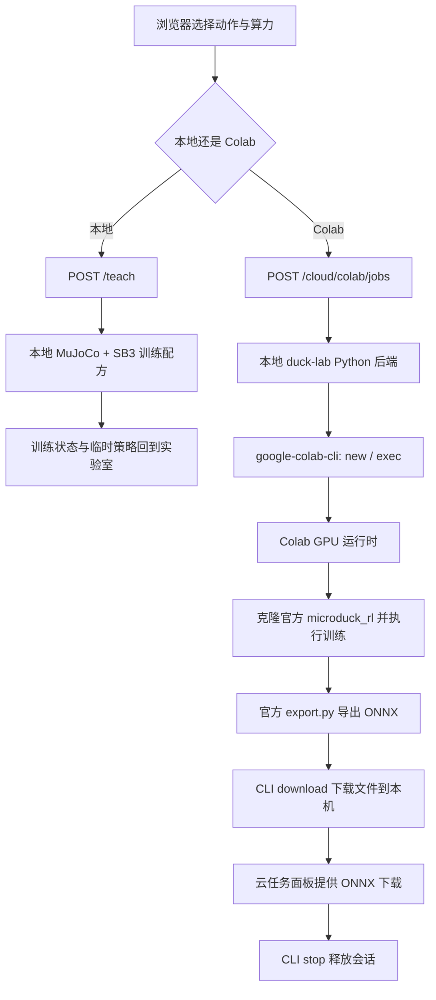

# Google Colab 训练入口与交付流程排查报告

排查日期：2026-09-29。代码基线：`microduck-lab` 当前工作树，HEAD `f2494a3`；包含排查前已有的未提交界面改动。排查本身没有分配 GPU 或启动训练。

后续已落实：报告完成后，`duck-lab` 新增 `GET /health`；训练面板在后端离线时显示启动命令并禁用提交，同时区分“检查中”“服务离线”和云账号错误；云端保持站立入口会明确提示其实际运行的是官方 VelStand（行走＋跌倒恢复）任务。以下分析仍保留原始排查证据，便于回溯。

## 1. 结论

1. **在本机默认页面上，已复现“同一个动作，本机按钮可点，Colab 按钮变灰”。当前直接原因是 `duck-lab` 后端离线，而前端对本地和云端采用了不同的启用条件。** 前端 `localhost:63317` 在运行，默认后端 `127.0.0.1:8788` 无监听且连接失败。浏览器页面也显示“离线”和后端不可达。
2. **Google CLI 的现有授权可以正常读取账号信息。** 使用项目虚拟环境的 CLI 实测：退出码 0，付费余额 `0.00 CCU`，使用率 `0.00/hr`，活动会话 `0`。当前代码允许零余额 T4；不能将按钮灰色归因于“免费额度为零”或“必须再次登录”。
3. **动作选择是必要条件，但不是充分条件。** 当前前端只允许 Microduck 的 `stand` 动作进入云端；其他本地动作，即使正确选中，仍被禁用。更进一步，`stand` 被映射为官方“行走＋跌倒恢复”任务，语义并不等价。
4. **项目使用 Google 官方 `google-colab-cli`，由本地 Python 后端调用。** 另有独立 Colab Notebook 备选文件；当前云端按钮不会打开或运行这个 Notebook。
5. **当前属于尚未完成真实 GPU 全流程验收的云端集成。** 下载 ONNX 已有实现，但实时训练可视化、断线续训、持续备份、自动加入本地策略库等未形成完整闭环。

证据边界：上述实时复现针对本机 `http://localhost:63317/` 和默认后端。未获得用户原始故障时的确切动作及页面 URL；如果当时使用其他 `?lab=` 地址，需要对那个后端另外确认。没有实测 Google 对本账号此刻的 GPU 分配结果。

## 2. 实测记录

| 检查 | 结果 | 能说明什么 |
|---|---|---|
| 前端进程工作目录 | 当前 `microduck-lab/duck-viewer` | 本次复现对应当前工作树 |
| 前端 `63317` | 正在监听，页面可打开 | Web 页面可访问 |
| 默认后端 `8788` | 没有监听，HTTP 连接失败 | 账号检查、训练提交均无法经过后端 |
| 浏览器初始教学状态 | 有历史 `stand still` 对话，但提示未选择动作 | 历史训练卡片不等于当前选中项 |
| 点击“保持站立”，选择 Colab | T4 可选，开始按钮禁用，提示连接 Colab | 已选动作也会被账号就绪条件挡住 |
| 同一动作切换本机 | 开始按钮启用，页面仍离线 | 本地按钮没有校验后端连通性 |
| 项目 CLI | `google-colab-cli 0.7.2` | 实际使用已安装 CLI |
| 同一 CLI 执行 `usage` | 成功，0 CCU、0/hr、0 活动会话 | 当前授权有效；不存在正在运行的 CLI 会话 |
| 前端动作映射测试 | 3/3 通过 | 当前“只有 stand 支持云端”的代码行为得到测试覆盖 |
| Colab 编排测试 | 11/11 通过 | 本地模拟的零余额、取消、释放等分支通过 |
| 真实 GPU 训练→导出→下载 | 本次未执行 | 不可据上述测试宣称端到端可用 |

最初 CLI 在工具沙箱中因写入自身日志受限失败；放行正常日志写入与已有凭据刷新后，`usage` 成功。该沙箱错误不是用户应用的根因。未要求重新登录，也未输出凭据内容。

## 3. 按钮实际判定逻辑

代码：`duck-viewer/components/TeachPanel.tsx:1683–1690`。

```ts
const cloudAccountReady = compute === "colab"
  ? colabAccount.connected &&
    (colabGpu === "T4" || (typeof colabAccount.balance === "number" && colabAccount.balance > 0))
  : /* Hugging Face / local checks */;

const canLaunch = !!actionText && !cloudBusy && !trainingInProgress &&
  (compute === "local" || (!!cloudTask && cloudAccountReady));
```

| 条件 | 本机训练 | Colab 训练 |
|---|---|---|
| 当前有动作文本/已保存的动作选择 | 需要 | 需要 |
| 没有正在提交/运行的任务 | 需要 | 需要 |
| 动作有官方云端映射 | 不要求 | 需要 |
| 后端查询到 CLI 已连接 | 不要求 | 需要 |
| 付费余额大于零 | 不要求 | T4 不要求；其他 GPU 要求 |
| 后端在线的统一显式检查 | 缺少 | 缺少，但账号查询失败会间接禁用 |

因此，“本机按钮可点击”只能说明前端的少量条件满足，**不证明本地训练服务真的能运行**。当后端离线时，云账号状态保持初始 `connected: false`；本机分支却直接绕过这项检查。

另外，`TeachPanel.tsx:1222–1226` 的云端动作识别主要依赖建议项和精确文本匹配。例如点击“保持站立”会写入 `stand still`，可以识别；自由输入的近义表达未必能解析为云端任务。本地后端则有独立的行为匹配流程，双方不是同一个解析器。

## 4. 接入架构与原项目差异

### 4.1 当前实际调用链



实际实现 `microduck_local/src/microduck_local/colab_jobs.py`：

1. `24–38`：优先使用当前 Python 环境旁的 `colab` 可执行程序，通过 `subprocess` 调用。
2. `41–56`：执行 `colab usage`，解析付费余额与使用率。
3. `118–144`：校验任务、GPU、迭代数、环境数及账号，创建后台线程。
4. `149`：执行 `colab new -s <session> --gpu T4` 等命令。
5. `162–185`：查询 GPU，通过 `colab exec` 在远端启动 Python 训练进程。
6. `59–98`：远端克隆 `pollen-robotics/microduck_rl`，`uv sync` 后执行 `uv run train <TASK>`，最后执行官方 `scripts/export.py`。
7. `191–225`：每约 15 秒经 CLI 读取远端状态；完成后下载 `policy.onnx`、`checkpoint.pt`、`train.log`、`error.log`。
8. `230–246`：在收尾流程中尝试 `colab stop` 并记录释放状态。

这不是“浏览器直接借用已登录的 Colab 网页会话”，也不是 SSH 接入实现。CLI 使用自己的授权凭据；浏览器登录 Google 与 CLI 授权是不同状态。本次已有 CLI 授权有效。

### 4.2 两个原项目要分别理解

| 项目 | 训练对象与入口 | 与当前功能的关系 |
|---|---|---|
| Jonathan Hawkins 的 `microduck-lab` | 选择/描述行为，`POST /teach`，本地 MuJoCo + Stable Baselines 3 | 当前界面与本地教学流程的来源 |
| Pollen Robotics 的 `microduck_rl` | 指定注册任务 ID，`uv run train <TASK>`，MuJoCo Warp + mjlab | 当前 Colab 远端真正运行的训练栈 |
| 当前 `microduck-lab-cloud` 分支 | 把教学面板的少数行为映射到官方任务并交给 CLI | 新增的云端适配层 |

本地保存的上游 Lab 分支中没有当前 Colab 提交流程。官方 RL 入口 `microduck_rl/src/mjlab_microduck/train_cli.py` 自带 `--hf-jobs` 路径；本分支的 Colab 集成在外层完成。

**“训练前先选动作/任务”这一理解是对的。** 但这里的“动作”是奖励函数、任务环境和课程组成的训练目标，不是必须先选择一个关键帧动画。现有云端提交也不会把本地关键帧、修改过的奖励权重或本地课程自动搬到官方训练任务中。

### 4.3 免费层与官方网页为什么不能等同

Google 已发布官方 Colab CLI，支持创建运行时、远程执行和下载产物，不能笼统说“Colab 无法用 CLI 接入”。

- [Google 官方 CLI 发布说明](https://developers.googleblog.com/introducing-the-google-colab-cli/)
- [Google Colab CLI 官方仓库](https://github.com/googlecolab/google-colab-cli)

Google FAQ 同时说明免费资源动态分配、不保证可用性，并对无正余额时绕开 Notebook 的远程控制和主要通过其他 Web UI 交互设有限制。因此，官方 Notebook 中能使用免费 GPU，不能直接证明当前外部 Web 工具的自动化方式也有相同权益；官方 CLI 的存在也不是免费 T4 分配保证。

来源：[Google Colab FAQ](https://research.google.com/colaboratory/faq.html)。

**这些平台边界不是本次灰色按钮的已证实直接原因。** 灰色发生在前端，本次尚未向 Google 发出 GPU 分配请求。要判断本账号分配是否被拒绝，必须观察实际 `colab new` 的返回结果，不能用 0 CCU 或官方网页可用替代这个证据。

## 5. 按严重程度排列的问题

### 🔴 问题 1：后端离线，本地按钮仍然呈现可用

位置：`duck-viewer/lib/lab.ts:6–11`、`TeachPanel.tsx:1195`、`1286–1313`、`1683–1690`。

当前默认后端不可达。云账号状态维持未连接，本地分支绕过账号检查，制造“本地能训练、只有云端不行”的误导。账号提示又建议连接 Colab，容易把后端问题误诊为登录问题。

建议：建立独立的后端健康状态；断开时统一禁用提交，显示“训练服务未启动/连接已断开”，提供明确恢复步骤；后端恢复后再检查 CLI 授权。统一启动器应启动两个服务并做就绪检查。

现有启动方式需运行两个进程：在 `microduck_local` 下执行 `uv run duck-lab`，在 `duck-viewer` 下执行 `npm run dev`。本次报告没有启动或重启这些服务，也没有查明原后端进程为何退出。

### 🔴 问题 2：大部分已选择动作根本没有云端实现

位置：`duck-viewer/lib/cloudCompute.ts:30–33`。

```ts
if (robotId !== "microduck") return null;
if (behaviorId === "stand") return "Mjlab-VelStand-Flat-MicroDuck";
return null;
```

单脚站立、下蹲、头倒立、原地转圈及其他机器人动作没有映射；选择这些动作后切换云端必然禁用，与 Google 额度无关。后端白名单虽允许 Velocity、VelStand 两个任务，统一教学面板只暴露 stand → VelStand 这一条。

建议：把每个动作支持哪些执行方式直接标在动作卡上，并从后端统一返回任务能力。对尚未移植的行为明确写“尚未支持云端”；需要同配方云训练时，应真正移植本地训练器/课程，而不是随意映射到相近名称的官方任务。

### 🔴 问题 3：“保持站立”云端映射改变了训练目标

位置：`cloudCompute.ts:32`；本地 `behaviors/poses.py:119`；官方 `microduck_velstand_env_cfg.py:1`。

本地 `stand` 的目标是双脚站稳、保持原地姿态；官方 VelStand 明确是行走＋跌倒恢复，并继承行走任务的速度命令和训练配置。云请求只传 `task/gpu/iterations/envs`，不会把本地站立奖励或课程传过去。

影响：用户以为只换了算力，实际上任务、算法和训练目标都变了。现有映射测试虽然通过，却只验证字符串，未验证语义。

建议：云端明确列出官方任务“行走”“行走＋跌倒恢复”等；若保留“保持站立”的统一入口，应实现并验收真正对应的云端站立任务。不能仅修改任务名字就声称等价。

### 🟠 问题 4：账号检查吞掉真实失败原因

位置：`colab_jobs.py:41–56`。

`colab usage` 只要退出码非零，就统一返回“请运行 colab usage 连接 Google 账号”。网络、代理、凭据刷新、服务端响应等错误都会被折叠成“未连接”；超时只有一条原始消息。付费余额接口成功也不等于 GPU 可分配。

建议：拆分 CLI 安装、授权、网络、付费余额和运行时分配状态；保留脱敏错误分类及检查时间。优先验证现有凭据而非直接要求重新登录。

### 🟠 问题 5：断线和远端进程失联可造成长时间假运行

位置：`colab_jobs.py:179–200`。

远端训练以后台进程启动，前端看到的是本地线程轮询的状态。CLI 轮询失败返回非零时直接 `continue`，没有连续失败上限或总时长上限；持续读到 `{}` 也没有启动超时。远端被回收、进程异常消失或状态文件未生成时，任务可能一直显示 running，进而阻止下一次训练。

建议：增加分配/启动/训练阶段超时、最后成功心跳和有限重试；区分 unknown/disconnected/failed，重新查询实际会话状态，再决定释放和解除占用。异常退出后的自动续训目前不存在。

### 🟠 问题 6：产物下载存在，但“训练完即可在工具中用”的闭环未完成

位置：`colab_jobs.py:21, 213–225`；`viz_server.py:962–967`；`CloudPanel.tsx:253`。

云端结果放在 `runs/colab/<job-id>/policy.onnx`；策略库发现函数只查 `RUNS_DIR` 的直接子目录下的 `policy.onnx`。当前云任务面板提供下载链接，没有自动入库或加载该云端产物的调用。

下载各文件的返回码未逐项验证；成功主要以 ONNX 文件存在且非空判断，不验证图结构、输入输出契约、数值有效性或行为质量。Checkpoint 下载失败也可能仍将任务标为 done，然后释放远端。

建议：统一 run 目录/清单，逐项校验必要产物并重试；记录机器人、任务、训练配置、源码版本、归一化及观测/动作契约；通过校验后加入策略库，提供“仿真预览”。将“训练完成”“导出成功”“模型验证通过”分开记录。实机使用前仍需官方 sim2real 评估。

### 🟡 问题 7：可重复性与 Notebook 备选流程不完整

位置：`colab_jobs.py:71–75`；`notebooks/microduck_train.ipynb`。

云端按默认分支浅克隆官方仓库，没有固定训练源码提交；本地已锁定环境不等于远端版本固定。不同日期提交相同参数可能获取不同代码。

Notebook 文件可以手动在官方 Colab 网页中执行，但只有独立的说明和训练单元，默认训练 Velocity；不会接收教学面板当前动作，没有自动 Drive 备份，也没有把结果导回策略库的流程。它是备选脚本，不是当前按钮的另一种接入实现。

建议：固定已验收源码提交并记录依赖；从明确的云任务配置生成 Notebook，支持任务选择、断点保存、显式导出与导入。免费 Notebook 路径应直接说明需在 Google 页面操作，不包装成已经实现的自动托管训练。

## 6. 建议的使用与交付逻辑

### 6.1 用户使用流程

1. 启动工具后先通过后端健康检查，页面显示服务在线。
2. 选择机器人与明确的训练任务；动作卡显示本地/Colab 自动化/Colab Notebook 的实际支持情况。
3. 选择运行方式。展示实际训练栈及目标；换训练目标时必须让用户知道。
4. Colab 自动化检查已有 CLI 凭据与连接；T4 请求不以零 CCU 阻止，但展示分配不保证及适用边界。免费 Notebook 路径则生成任务 Notebook，在官方页面中运行。
5. 提交后分别显示排队/分配、安装、训练、导出、下载、验证、释放状态。不能把“请求提交成功”写成“训练已经开始”。
6. 过程中同步必要日志与 Checkpoint，保留明确的停止与释放结果。
7. 结束后校验产物、自动加入策略库，支持仿真预览；通过行为评估后才进入部署流程。

### 6.2 修复优先级

| 优先级 | 工作 | 验收标准 |
|---|---|---|
| P1 | 后端就绪检测和统一禁用原因 | 后端关闭时，本地/云端都不能误导为可训练 |
| P1 | 修正动作能力和任务映射 | 已选动作不会静默变为另一训练目标 |
| P1 | 明确免费 Notebook 与 CLI 自动化入口 | 入口描述与实际执行方式一致 |
| P2 | 分类错误、超时与会话恢复 | 网络或远端异常不会永久卡在 running |
| P2 | 可靠下载、模型验证与自动入库 | 成功任务能直接在本工具中预览，恢复文件齐全 |
| P2 | 固定版本与真实端到端验收 | 同配置可追溯，至少一次真实 GPU 冒烟成功 |

## 7. 验证方案及本次结果

已执行：

1. 前端实际页面复现；同一 `stand still`，本机可点、Colab 禁用；后端持续离线。
2. 在正常权限环境下调用与应用相同的项目 CLI `usage`；读取成功且零活动会话。
3. `npm --prefix duck-viewer test -- lib/cloudCompute.test.ts`：3 项通过。
4. 复用本机缓存的 pytest，运行 `microduck_local/tests/test_colab_jobs.py`：11 项通过。测试文件明确不分配真实 Colab 运行时。
5. 检查 README 的验证声明：截至其 2026-09-27 记录，尚未完成真实 GPU 训练、导出与下载全流程。当前项目目录下也未发现 `microduck_local/runs/colab` 产物目录；这只能说明本工作目录中未找到，不能排除其他机器曾运行。

后续正式验收应包括：

1. 后端在线＋支持任务＋CLI 已连接＋零 CCU＋T4：按钮允许请求。
2. 后端离线、未选动作、不支持动作、授权失效、Google 拒绝分配：分别给出准确原因。
3. 用小环境数、少量迭代完成一次真实 GPU 冒烟：训练、导出、下载、ONNX 契约校验、仿真加载及确认释放。冒烟成功只证明链路，不证明学会动作。
4. 在分配、训练、下载阶段分别取消；模拟网络失败、运行时消失和本地后端重启；保证状态最终可恢复并核实会话释放。
5. 用足够训练预算和多种初始条件评估动作效果，保留仿真视频与测量结果；不得只凭奖励曲线或文件存在宣称可部署。

**交付判断：当前具备云训练适配代码和本地回归测试，尚不具备“所有本地动作可无缝切换免费 Colab、自动训练并回到工具中使用”的完整交付能力。**

## 8. 本次修复后的现场结果

1. `GET /health` 已接入前端健康探测。后端离线时，页面会显示启动命令 `cd microduck_local && uv run duck-lab`，并说明“训练服务未启动”，不再只留下灰色按钮。
2. 云算力账号面板已移除训练操作卡；训练入口统一留在“训练”面板。界面可见的“教学”已统一为“训练”。
3. 所有动作仍可看到算力选择，但只有存在明确云任务映射的动作可以提交 Colab；不支持的动作会显示具体原因。当前自动化 Colab 映射仍只有 `Microduck / 保持站立`，对应官方 `VelStand` 任务，并在界面标明目标差异。
4. 已将本地 `google-colab-cli` 约束升级到 `>=0.7.4`，锁定 `jupyter-kernel-client 0.9.0`，并执行 `uv sync`。此前截图中的 `JupyterSubprotocol` 崩溃会转换为可操作提示，而不是直接显示 Python 堆栈。
5. 修复后现场验证：本地 Web `http://localhost:63317` 显示 `● 在线`；云面板显示账号状态、最近任务和中文化的 CLI 兼容性错误提示。前端单测 3 项通过，Next 构建产物生成，Python 全量 AST 检查通过。

本次没有发起真实 GPU 请求，因此仍需按第 7 节的真实 T4 冒烟流程验收 Google 的实际分配结果。
